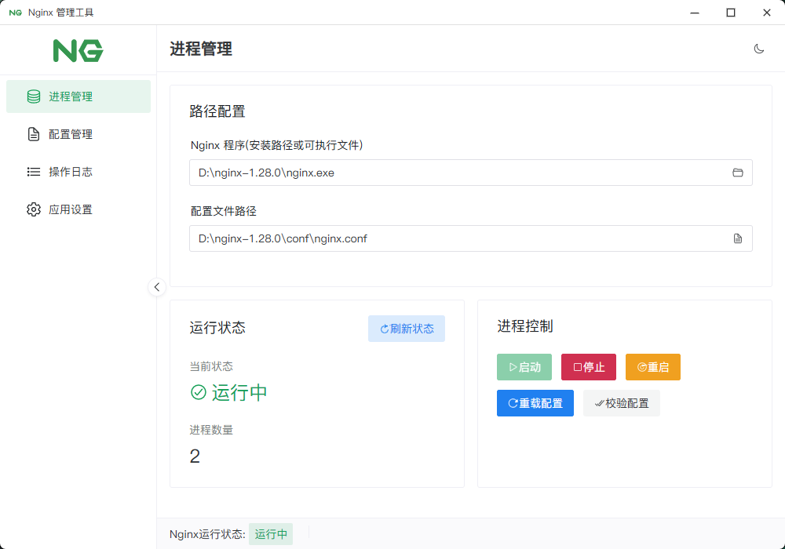
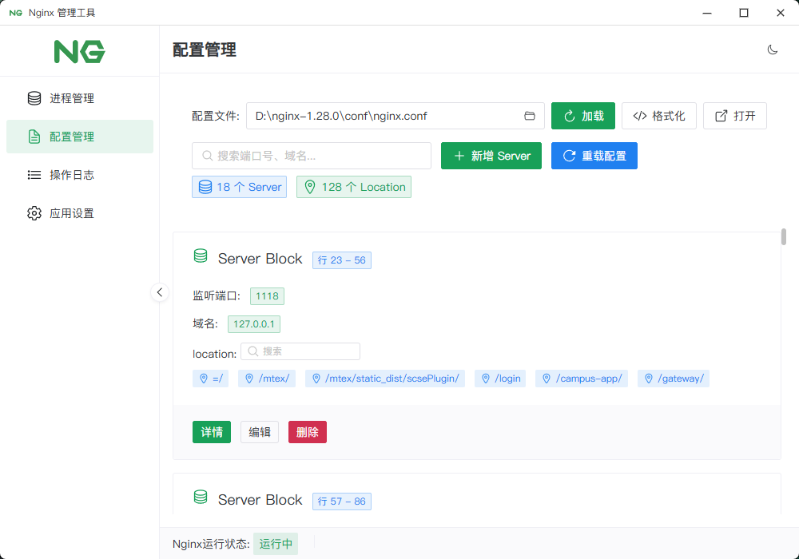
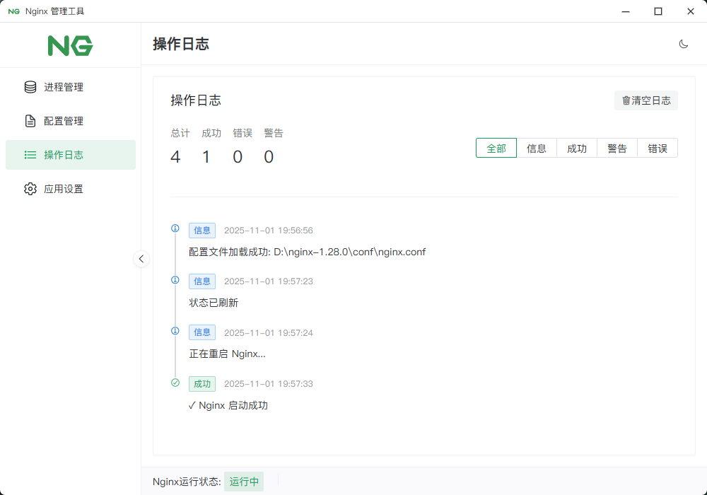
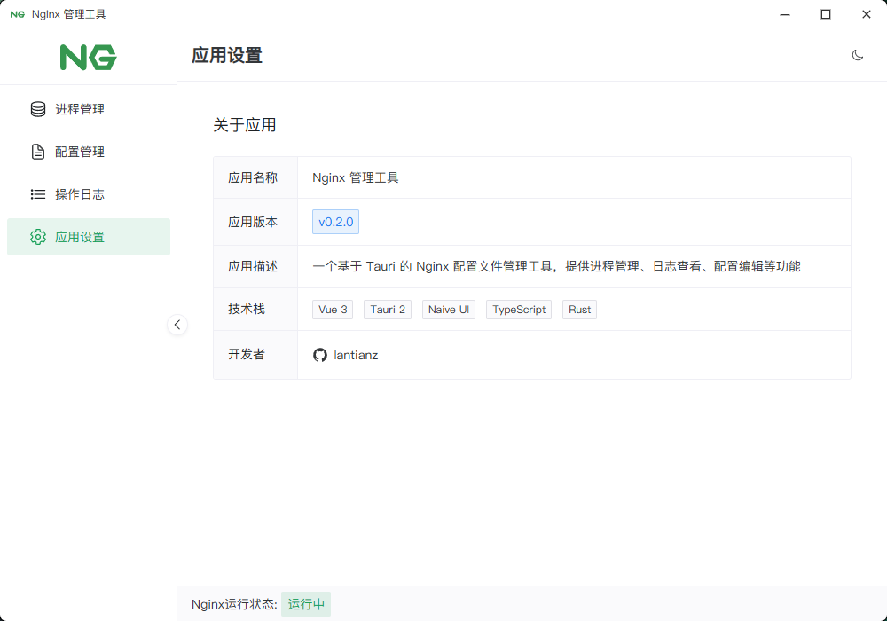
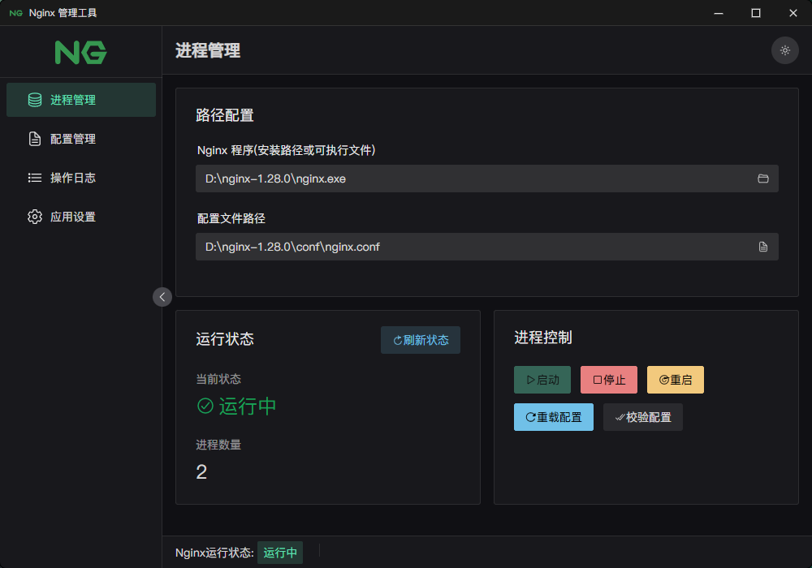

# Nginx 管理工具

> 一个基于 Tauri 2 和 Vue 3 的现代化 Nginx 配置管理桌面应用

## 📸 截图预览

### 1. 进程管理


### 2. 配置管理


### 3. 操作日志


### 4. 应用设置


### 5. 黑色主题


## 📖 项目介绍

Nginx 管理工具是一款专为 Windows 平台设计的桌面应用程序，旨在简化 Nginx 服务器的配置管理和进程控制。通过直观的图形界面，用户可以轻松管理 Nginx 配置文件、控制服务进程、查看日志，无需手动编辑配置文件或使用命令行。

### 主要功能

- ✅ **Nginx 进程管理**：启动、停止、重启、重载配置
- ✅ **配置文件管理**：查看、编辑、新增、删除 Server 块
- ✅ **文本编辑器**：集成 Monaco Editor，支持 Nginx 语法高亮
- ✅ **日志查看**：实时查看 Nginx 日志，支持日志级别过滤
- ✅ **应用设置**：主题切换（浅色/深色/自动）、路径配置
- ✅ **文件操作**：一键打开配置文件，使用系统默认编辑器

## 🛠️ 技术栈

### 前端技术
- **框架**：Vue 3 (Composition API)
- **语言**：TypeScript
- **UI 库**：Naive UI
- **状态管理**：Pinia
- **路由**：Vue Router
- **代码编辑器**：Monaco Editor (VS Code 编辑器内核)
- **图标**：Vicons (Ionicons 5)
- **构建工具**：Vite

### 后端技术
- **框架**：Tauri 2
- **语言**：Rust
- **序列化**：Serde
- **编码转换**：encoding_rs (处理 Windows GBK 编码)

## ✨ 功能特性

### 1. Nginx 进程管理
- 实时显示 Nginx 进程状态（运行中/已停止）
- 一键启动、停止、重启 Nginx 服务
- 支持重载配置（无需重启服务）
- 自动检测进程状态变化

### 2. 配置文件管理
- 解析并展示 Nginx 配置文件结构
- 以卡片形式展示每个 Server 块
- 显示关键信息：监听端口、域名、Location 列表
- 支持搜索功能，快速定位 Server 块

### 3. Server 块操作
- **查看详情**：查看 Server 块的原始配置
- **编辑配置**：使用 Monaco Editor 编辑 Server 块
- **新增 Server**：提供模板，快速创建新的 Server 块
- **删除 Server**：安全删除 Server 块（带确认对话框）
- **打开文件**：使用系统默认程序打开配置文件

### 4. Location 标签交互
- 鼠标悬浮显示 Location 的完整配置
- 配置内容保持原始格式，支持横向滚动

### 5. 日志查看
- 实时查看 Nginx 错误日志
- 支持日志级别过滤（全部/错误/警告/信息）
- 自动滚动到最新日志
- 日志内容自动换行，便于阅读

### 6. 应用设置
- 主题切换：浅色、深色、跟随系统
- 路径配置：Nginx 可执行文件路径、配置文件路径
- 应用信息：版本号、技术栈、开发者信息
- 更新日志：查看版本历史和功能更新

### 7. 用户体验优化
- 自定义滚动条样式
- UI 元素文字不可选中（提升专业感）
- 禁用右键菜单
- 响应式布局，适配不同屏幕尺寸
- 深色主题优化，护眼舒适

## 💻 系统要求

- **操作系统**：Windows 10 / Windows 11 (x64)
- **Nginx**：需要预先安装 Nginx（推荐版本 1.20+）
- **磁盘空间**：约 50 MB

## 📦 安装

### 下载安装包

从 [Releases](https://github.com/lantianz/nginx-config-manager/releases) 页面下载最新版本的安装包：

- **推荐**：`nginx-config-manager_0.2.0_x64-setup.exe` (NSIS 安装包)
- **备选**：`nginx-config-manager_0.2.0_x64_en-US.msi` (MSI 安装包)

### 安装步骤

1. 双击下载的安装包
2. 按照安装向导提示完成安装
3. 启动应用程序

### 首次运行配置

1. 打开应用后，进入"设置"页面
2. 配置 Nginx 可执行文件路径（例如：`C:\nginx\nginx.exe`）
3. 配置 Nginx 配置文件路径（例如：`C:\nginx\conf\nginx.conf`）
4. 保存设置后，即可开始使用

## 🚀 开发环境搭建

### 前置要求

- **Node.js**：v18.0.0 或更高版本
- **Rust**：1.70.0 或更高版本
- **npm** 或 **yarn** 或 **pnpm**

### 克隆仓库

```bash
git clone https://github.com/lantianz/nginx-config-manager.git
cd nginx-config-manager
```

### 安装依赖

```bash
npm install
```

### 运行开发服务器

```bash
npm run tauri dev
```

应用将在开发模式下启动，支持热重载。

## 🔨 打包构建

### 构建生产版本

```bash
npm run tauri build
```

### 构建产物位置

构建完成后，安装包将生成在以下目录：

```
src-tauri/target/release/bundle/
├── msi/
│   └── nginx-config-manager_0.2.0_x64_en-US.msi
└── nsis/
    └── nginx-config-manager_0.2.0_x64-setup.exe
```

### 安装包类型

- **NSIS 安装包** (`.exe`)：现代化安装体验，文件更小，推荐使用
- **MSI 安装包** (`.msi`)：Windows Installer 标准格式，适合企业环境

## 📚 使用说明

### 基本使用流程

1. **配置路径**：首次使用时，在"设置"页面配置 Nginx 路径
2. **加载配置**：在"配置管理"页面点击"加载配置"按钮
3. **管理进程**：在"进程管理"页面控制 Nginx 服务
4. **编辑配置**：在"配置管理"页面编辑 Server 块
5. **查看日志**：在"日志查看"页面监控 Nginx 运行状态

### 常见问题

**Q: 为什么无法启动 Nginx？**
A: 请检查 Nginx 路径是否正确，以及端口是否被占用。

**Q: 配置文件修改后不生效？**
A: 修改配置后需要点击"重载配置"或"重启"按钮。

**Q: 日志显示乱码？**
A: 应用已自动处理 Windows GBK 编码，如仍有问题请检查 Nginx 日志编码设置。

**Q: 如何备份配置文件？**
A: 建议在修改配置前手动备份 `nginx.conf` 文件。

## ‍💻 作者

**lantianz**

- GitHub: [@lantianz](https://github.com/lantianz)

## 🙏 致谢

感谢以下开源项目：

- [Tauri](https://tauri.app/) - 跨平台桌面应用框架
- [Vue.js](https://vuejs.org/) - 渐进式 JavaScript 框架
- [Naive UI](https://www.naiveui.com/) - Vue 3 组件库
- [Monaco Editor](https://microsoft.github.io/monaco-editor/) - 代码编辑器
- [Rust](https://www.rust-lang.org/) - 系统编程语言

## 📝 更新日志

查看完整的更新历史，请访问 [CHANGELOG.md](CHANGELOG.md)。

---

**⭐ Star ⭐**
