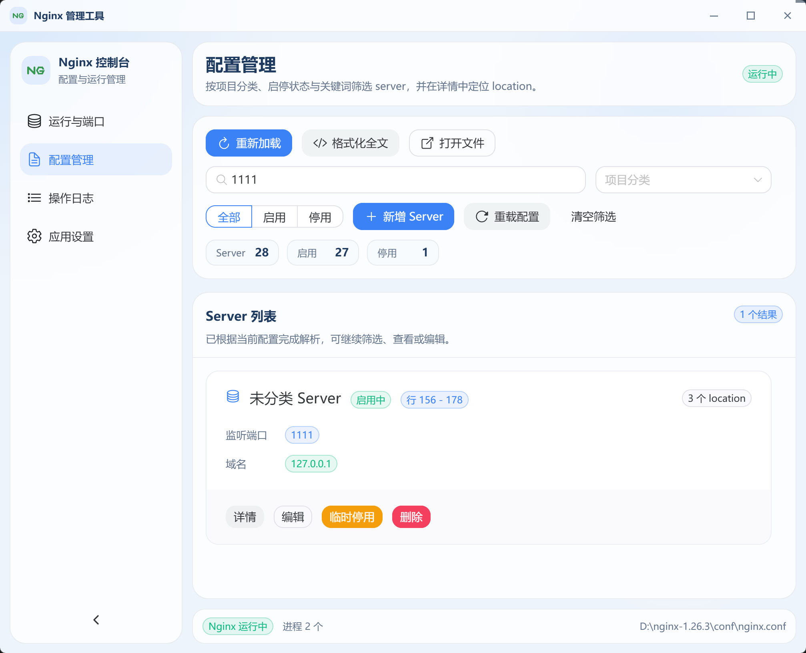
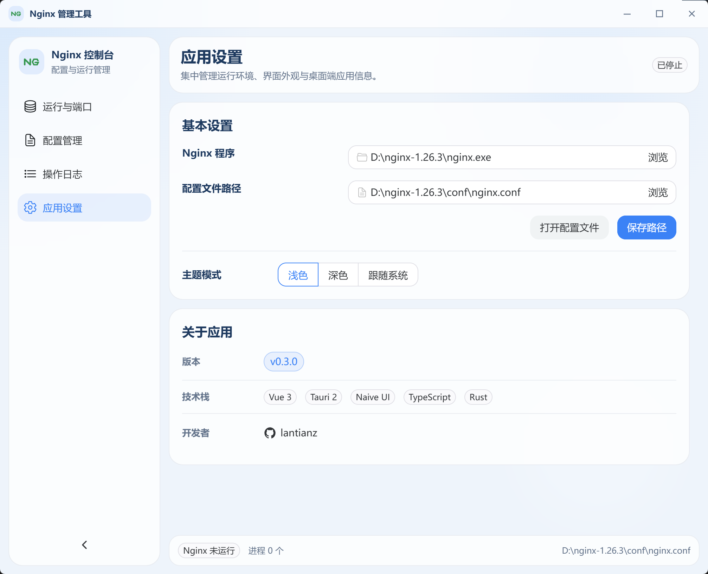

# Nginx 管理工具

> 一个基于 Tauri 2 和 Vue 3 的 Windows 桌面版 Nginx 管理工具

## 📸 截图预览

### 1. 进程管理


### 2. 配置管理



### 3. 操作日志


### 4. 应用设置



### 5. 黑色主题


## 📖 项目介绍

Nginx 管理工具是一款专为 Windows 平台设计的桌面应用程序，旨在简化 Nginx 服务器的配置管理和进程控制。通过直观的图形界面，用户可以轻松管理 Nginx 配置文件、控制服务进程、查看日志，无需手动编辑配置文件或使用命令行。

### 主要功能

- ✅ **运行与端口**：启动、停止、重启、重载、配置校验、指定端口占用查询与释放
- ✅ **配置管理**：自动加载配置、查看 / 编辑 / 新增 / 删除 / 临时停用 Server 块
- ✅ **项目分类**：基于 `server` 首行注释识别分类，支持分类筛选
- ✅ **定位编辑**：集成 Monaco Editor，支持 location 搜索、跳转与高亮定位
- ✅ **操作日志**：集中查看关键操作结果
- ✅ **应用设置**：统一管理 Nginx 路径、配置文件路径与主题

## 🛠️ 技术栈

### 前端技术

- **框架**：Vue 3 (Composition API)
- **语言**：TypeScript
- **UI 库**：Naive UI
- **状态管理**：Pinia
- **路由**：Vue Router
- **代码编辑器**：Monaco Editor (VS Code 编辑器内核)
- **图标**：Vicons (Ionicons 5)
- **构建工具**：Vite

### 后端技术

- **框架**：Tauri 2
- **语言**：Rust
- **序列化**：Serde
- **编码转换**：encoding_rs (处理 Windows GBK 编码)

## ✨ 功能特性

### 1. 运行与端口

- 实时显示运行状态、进程数量
- 一键启动、停止、重启、重载与配置校验
- 支持按端口手动查询占用详情
- 可查看进程路径、命令行、启动用户、启动时间，并支持结束进程或释放端口

### 2. 配置管理

- 进入页面后自动读取已保存的 `nginx.conf`
- 支持按关键词、启用状态、项目分类筛选 Server
- 支持新增、编辑、删除、临时停用 / 恢复启用 Server
- 详情 / 编辑弹窗内支持 location 检索、滚动定位与高亮
- 支持直接打开配置文件、格式化全文、重载配置

### 3. 日志与设置

- 日志页集中查看关键操作结果
- 设置页统一管理 Nginx 路径、配置路径和主题
- release 版本默认请求管理员权限，更适合端口与进程操作

### 4. 体验优化

- 系统工具风格的桌面布局，标题栏 / 工作区 / 状态栏分层固定
- 滚动区域单独控制，避免整页滚动和滚动条顶出卡片
- 默认禁止无关文本选中，输入框、日志、代码编辑器等区域允许选择

## 💻 系统要求

- **操作系统**：Windows 10 / Windows 11 (x64)
- **Nginx**：需要预先安装 Nginx（推荐版本 1.20+）
- **磁盘空间**：约 50 MB

## 📦 安装

### 下载安装包

从 [Releases](https://github.com/lantianz/nginx-config-manager/releases) 页面下载最新版本的安装包：

- **推荐**：`nginx-config-manager_0.0.1_x64-setup.exe` (NSIS 安装包)
- **备选**：`nginx-config-manager_0.0.1_x64_en-US.msi` (MSI 安装包)

### 安装步骤

1. 双击下载的安装包
2. 按照安装向导提示完成安装
3. 启动应用程序

### 首次运行配置

1. 打开应用后，进入"设置"页面
2. 配置 Nginx 可执行文件路径（例如：`C:\nginx\nginx.exe`）
3. 配置 Nginx 配置文件路径（例如：`C:\nginx\conf\nginx.conf`）
4. 保存设置后，即可开始使用

## 🚀 开发环境搭建

### 前置要求

- **Node.js**：v18.0.0 或更高版本
- **Rust**：1.70.0 或更高版本
- **npm** 或 **yarn** 或 **pnpm**

### 克隆仓库

```bash
git clone https://github.com/lantianz/nginx-config-manager.git
cd nginx-config-manager
```

### 安装依赖

```bash
npm install
```

### 运行开发服务器

```bash
npm run tauri:dev
```

应用将在开发模式下启动，支持热重载。

## 🔨 打包构建

### 构建生产版本

```bash
npm run release:build
```

### 构建产物位置

构建完成后，安装包将生成在以下目录：

```
src-tauri/target/release/bundle/
├── msi/
│   └── nginx-config-manager_0.0.1_x64_en-US.msi
└── nsis/
    └── nginx-config-manager_0.0.1_x64-setup.exe
```

### 安装包类型

- **NSIS 安装包** (`.exe`)：现代化安装体验，文件更小，推荐使用
- **MSI 安装包** (`.msi`)：Windows Installer 标准格式，适合企业环境

## 📚 使用说明

### 基本使用流程

1. **先到设置页**：配置 `nginx.exe` 与 `nginx.conf` 路径
2. **进入配置管理**：页面会自动加载并解析当前配置
3. **筛选 Server**：按关键词、启用状态、项目分类快速定位
4. **进入详情或编辑**：在弹窗内通过 location 导航直接跳转对应配置位置
5. **进入运行与端口**：执行启动、重载、配置校验或端口释放操作

### 常见问题

**Q: 为什么无法启动 Nginx？**
A: 请先检查 `nginx.exe` 路径是否正确，再确认配置校验是否通过，以及目标端口是否被其他进程占用。

**Q: 配置文件修改后不生效？**
A: 修改配置后需要点击"重载配置"或"重启"按钮。

**Q: 为什么有些端口操作需要管理员权限？**
A: 结束进程、释放端口等操作依赖更高权限，release 版本会在启动时自动请求管理员权限。

**Q: 日志显示乱码？**
A: 应用已自动处理 Windows GBK 编码，如仍有问题请检查 Nginx 日志编码设置。

**Q: 如何备份配置文件？**
A: 建议在修改配置前手动备份 `nginx.conf` 文件。

## ‍💻 作者

**lantianz**

- GitHub: [@lantianz](https://github.com/lantianz)

## 🙏 致谢

感谢以下开源项目：

- [Tauri](https://tauri.app/) - 跨平台桌面应用框架
- [Vue.js](https://vuejs.org/) - 渐进式 JavaScript 框架
- [Naive UI](https://www.naiveui.com/) - Vue 3 组件库
- [Monaco Editor](https://microsoft.github.io/monaco-editor/) - 代码编辑器
- [Rust](https://www.rust-lang.org/) - 系统编程语言

## 📝 更新日志

查看完整的更新历史，请访问 [CHANGELOG.md](CHANGELOG.md)。

---

**⭐ Star ⭐**
